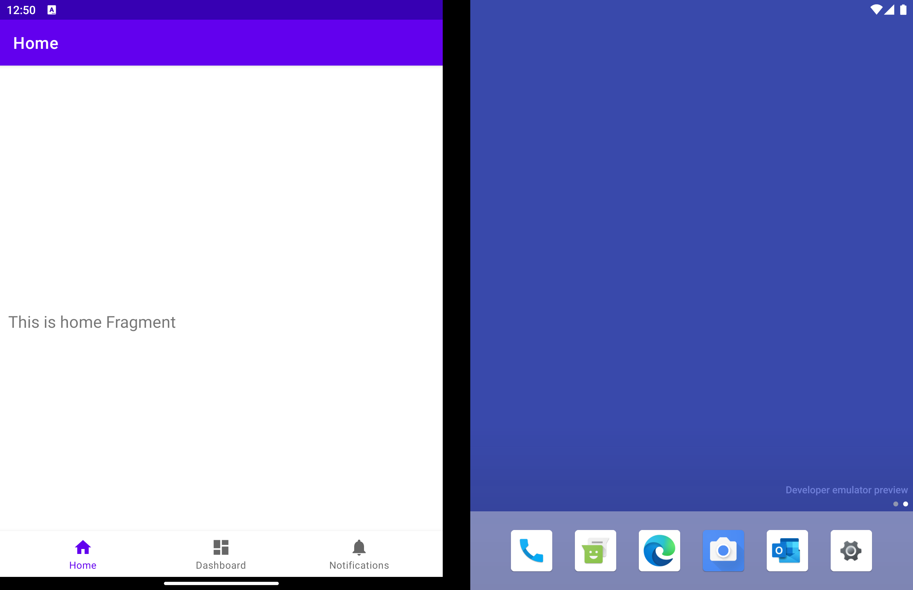
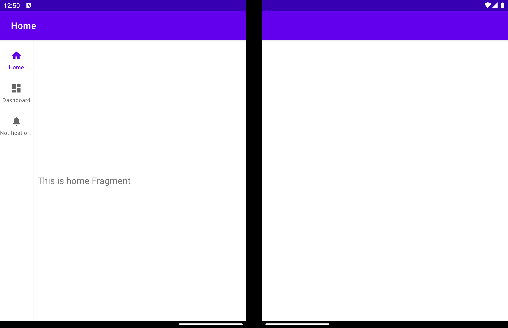
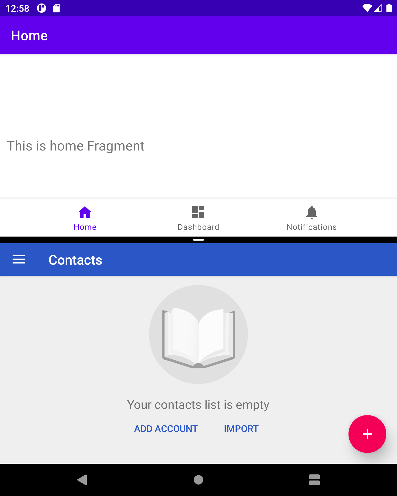
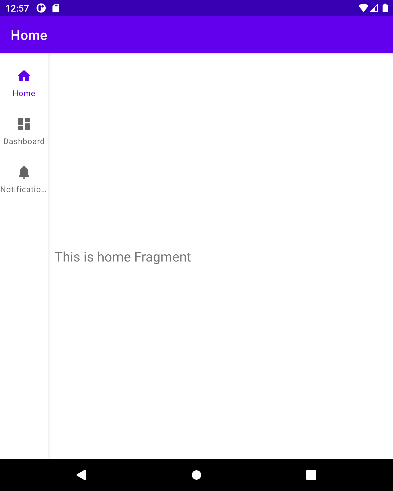

# NavigationRail-WM-Sample

This is a sample app that uses the following components in order to show an adjusted and dynamic UI that fits better with the specific device screen mode or form-factor used:
- [NavigationRail](https://github.com/material-components/material-components-android/blob/master/docs/components/NavigationRail.md)
- [BottomNavigation](https://github.com/material-components/material-components-android/blob/master/docs/components/BottomNavigation.md)
- [Jetpack WindowManager](https://developer.android.com/jetpack/androidx/releases/window)
- [Navigation](https://developer.android.com/jetpack/androidx/releases/navigation) (important, using new stuff coming in 2.4.0-alpha04 version)

## How does it work?

On single screen devices, a BottomNavigation will be shown to the user to navigate through the app,
but when there is a [FoldingFeature](https://developer.android.com/reference/androidx/window/FoldingFeature) separating the content, a NavigationRail will be used instead of the BottomNavigation providing a different and in some scenarios better user experience.

This approach can be easily adapted as well to tablets and big-screens.

### Examples

App running on a dual-screen device:

App running on a foldable device:

## Code of Conduct

This project has adopted the [Microsoft Open Source Code of Conduct](https://opensource.microsoft.com/codeofconduct/). 
For more information see the [Code of Conduct FAQ](https://opensource.microsoft.com/codeofconduct/faq/)
or contact [opencode@microsoft.com](mailto:opencode@microsoft.com) with any additional questions or comments.

## License

Copyright (c) Microsoft Corporation.

MIT License

Permission is hereby granted, free of charge, to any person obtaining a copy of this software and
associated documentation files (the "Software"), to deal in the Software without restriction,
including without limitation the rights to use, copy, modify, merge, publish, distribute,
sublicense, and/or sell copies of the Software, and to permit persons to whom the Software is
furnished to do so, subject to the following conditions:

The above copyright notice and this permission notice shall be included in all copies or substantial
portions of the Software.

THE SOFTWARE IS PROVIDED AS IS, WITHOUT WARRANTY OF ANY KIND, EXPRESS OR IMPLIED, INCLUDING BUT NOT
LIMITED TO THE WARRANTIES OF MERCHANTABILITY, FITNESS FOR A PARTICULAR PURPOSE AND NONINFRINGEMENT.
IN NO EVENT SHALL THE AUTHORS OR COPYRIGHT HOLDERS BE LIABLE FOR ANY CLAIM, DAMAGES OR OTHER
LIABILITY, WHETHER IN AN ACTION OF CONTRACT, TORT OR OTHERWISE, ARISING FROM, OUT OF OR IN
CONNECTION WITH THE SOFTWARE OR THE USE OR OTHER DEALINGS IN THE SOFTWARE.
